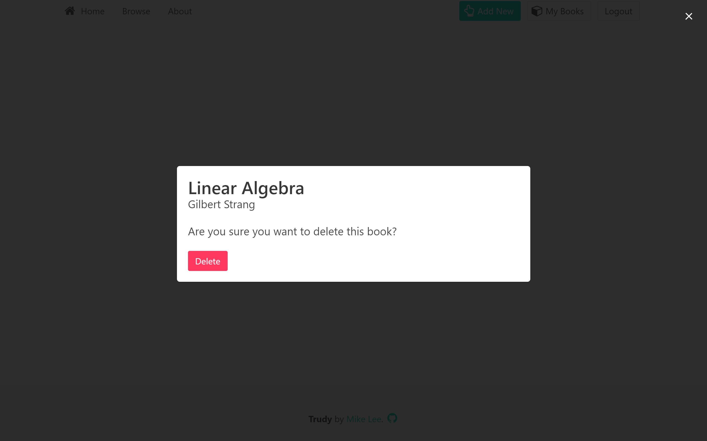

# Trudy

A practice django project to clone [TUSBE](http://tusbe.com/) (Toronto University Student Book Exchange)

This is a web application where students can post ads for used textbooks. 

## Key Features
#### v1.0
- Administration Page (Django built-in)
- User can REGISTER/LOGIN/LOGOUT
- User can view latest listings
- User can view details for a listed book
- User can POST/EDIT/DELETE new listing

## What I Learned
#### How To
- Use django's generic **class-based views** to handle common manipulations of objects (i.e., create, edit, delete, list)
- Implement pagination
- Use **Bulma** framework for front-end design
- Enhance UI to provide better user experience
- Modularize **templates** into snippets for further reuse and code readability
- Take django's built-in forms and customize them

## What Next
- Implement search feature
- Implement browse page with that allows filtering of objects; similar to that of django's admin site

## Preview
#### User Login Page

#### User Registration Page

#### Main page

#### Listing Detail Page

#### Create Listing Page

#### My Listings Page

#### Edit Listing Page

#### Listing Delete Page (Modal)

